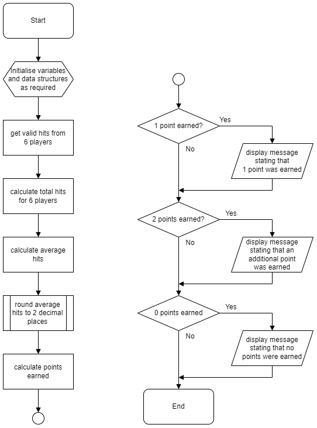
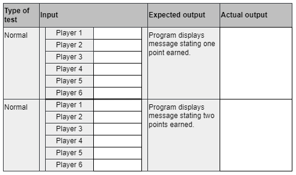

# N5 CS Specimen Task 2

In the board game ‘Capturing Olympus’, six players work as a team to earn points. One point is earned if the six players score a combined total of more than 50 hits. An additional point is earned if the average number of hits is greater than or equal to 10.

Read the following analysis and design carefully.

## Program analysis

A program is required to determine the number of points earned by the team.
The program will ask the user to enter the number of hits scored by each of the six players and store these values. When all six players’ hits have been entered, the program will calculate the total and average number of hits. A message indicating the points earned is then displayed to the user.

### Inputs

* a valid number of hits scored by each of the six players

### Processes

* calculate the total hits achieved by all six players
* calculate an average number of hits (total/6)
* determine if the six players have earned points

### Outputs

* a message is displayed if one point has been earned
* a message is displayed if the additional point has been earned
* a message is displayed if no points have been earned

### Assumptions

* the number of hits a single player can achieve is greater than or equal to 0 and less than or equal to 30
* the average should be displayed to two decimal places
* one point is earned if the total number of hits is greater than 50. An additional point is earned if the average number of hits is greater than or equal to 10

## Program design (flow chart)

___2a___ Using the program analysis and flowchart design, implement the program in a language of your choice. Ensure the program matches the design. (__15 marks__)

Print evidence of the program code.

___2b___ Complete the table below to create two sets of test data. You must demonstrate that the program correctly outputs the messages that one or both points have been earned. (__3 marks__)

Test your program using both sets of test data. Print evidence of inputs and outputs to show that you have completed each test.

___2c___ The program should ensure that only a valid number of hits can be entered for each of the six players. State two extreme and one exceptional numerical value that could be used as part of a test run to check that only a valid number of hits can be
entered: (__2 marks__)

* Extreme 1 ____
* Extreme 2 ____
* Exceptional ____

___2d___ Evaluate your program by commenting on the following:

* Fitness for purpose (__1 mark__)
* Efficiency of your code (__1 mark__)
* Robustness of your completed program (__1 mark__)
* Readability of your code (__2 marks__)